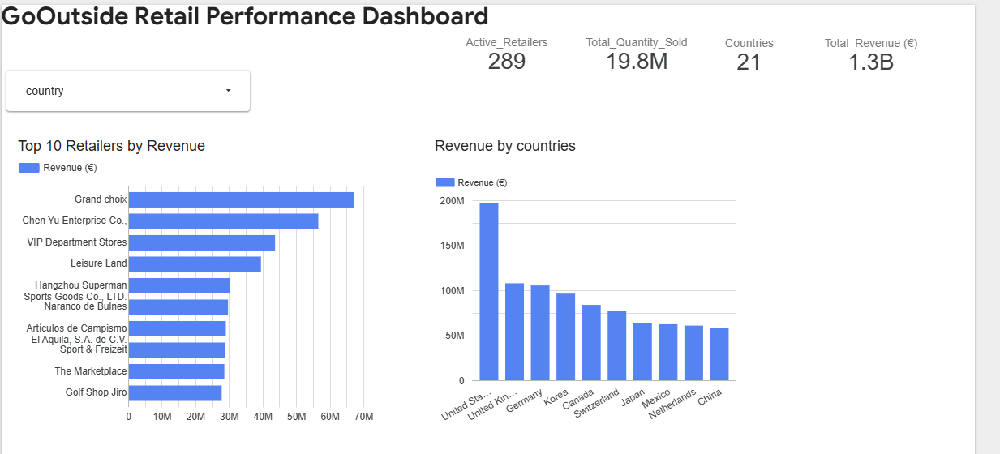
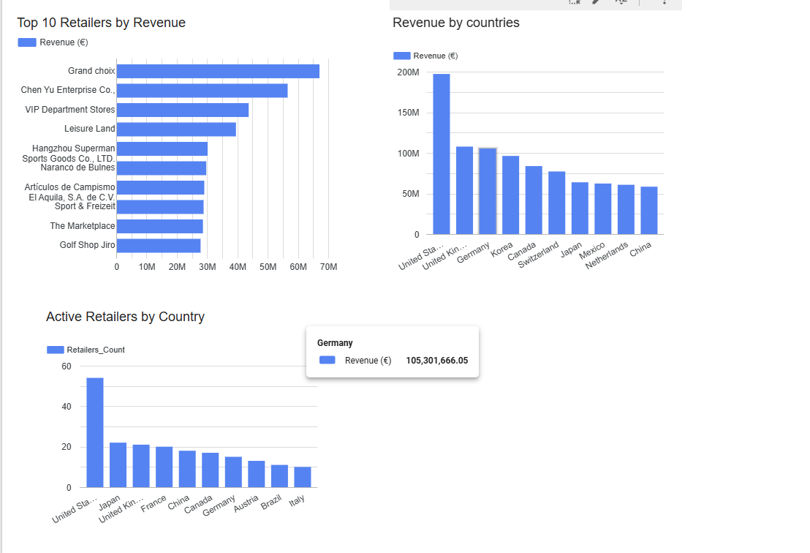
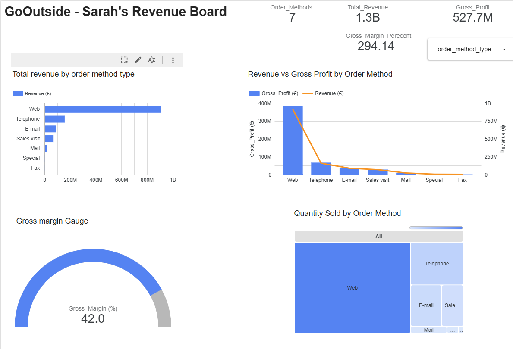

# GoOutside Retail Analytics

**BigQuery · SQL · Looker Studio · Stakeholder-focused BI**

GoOutside is a retail analytics case study about turning fragmented operational data into a usable decision-support system for non-technical stakeholders.

The project combines a **BigQuery data warehouse**, SQL analysis and **Looker Studio dashboards** designed around two different business users:

- **Dustin — Head of Retail Partnerships:** understand market composition, retailer concentration and country-level performance.
- **Sarah — Finance Manager:** understand how order methods contribute to revenue, volume and gross profit, and identify channels that may not justify their operating effort.

> **Business question:** How can a growing retailer turn scattered sales data into a scalable data layer and give each stakeholder the decision view they actually need?

## The business problem

GoOutside had years of sales, product and retailer data spread across separate files. The data existed, but the business lacked a reliable system that made it easy to store, query and communicate.

The solution therefore had three layers:

1. **Centralize the data** in BigQuery.
2. **Model and query the data** so business metrics are consistent and reusable.
3. **Deliver stakeholder-specific dashboards** in Looker Studio rather than asking business users to work directly with SQL.

This project is an important step between spreadsheet analysis and a more advanced product analytics application such as CustomerPulse: the emphasis is not only on finding an insight, but on designing a **data product around stakeholder decisions**.

## Dataset

The working data is split across four source tables:

| Table | Rows | Purpose |
|---|---:|---|
| Daily sales | 149,257 | Transaction-level quantity and pricing |
| Retailers | 562 | Retailer identity, type and country |
| Products | 274 | Product hierarchy, cost and list price |
| Order methods | 12 | Order-channel reference table |

The raw source files are not committed to this repository. See [`data/README.md`](data/README.md) for the schema and setup notes.

## Verified portfolio metrics

The supplied project data produces the following baseline metrics:

| KPI | Result |
|---|---:|
| Active retailers with sales | **289** |
| Quantity sold | **19.80M** |
| Countries with active sales | **21** |
| Total revenue | **€1.252B** |
| Gross profit | **€527.7M** |
| Weighted gross margin | **42.17%** |
| Active order methods | **7** |

These values were independently recalculated from the four source CSVs used in the project.

## Stakeholder 1 — Dustin, Head of Retail Partnerships

Dustin needs a market overview rather than transaction-level detail. His dashboard focuses on:

- top retailers by revenue
- revenue by country
- active retailers by country
- country filtering
- market concentration and retailer mix

### Commercial decision logic

The business case distinguishes between two market structures:

- **Markets dominated by a few large retailers:** focus on increasing sales volume by approximately **10% per retailer**.
- **More fragmented / competitive markets:** focus on increasing the number of active retailers by approximately **15%** to stimulate market activity.

The dashboard therefore answers two different questions before Dustin acts:

1. **Where is the commercial opportunity?** — revenue and active-retailer distribution by country.
2. **What kind of growth motion fits that market?** — deepen sales with dominant retailers or expand retailer coverage in fragmented markets.

### Selected findings

The largest revenue markets include the United States, United Kingdom, Germany and Korea. The United States is both the largest revenue market and the market with the largest number of active retailers.

Top individual retailers include **Grand choix**, **Chen Yu Enterprise Co.**, **VIP Department Stores** and **Leisure Land**.





## Stakeholder 2 — Sarah, Finance Manager

Sarah’s question is different: some order methods require people and operational effort, so she needs to understand which channels actually contribute to the business.

Her dashboard focuses on:

- revenue by order method
- gross profit by order method
- quantity sold by order method
- gross margin
- order-method filtering

### Order-method economics

| Order method | Revenue | Gross profit | Quantity sold |
|---|---:|---:|---:|
| Web | ~€909.6M | ~€383.4M | ~13.6M |
| Telephone | ~€157.9M | ~€66.5M | ~2.9M |
| E-mail | ~€87.9M | ~€37.9M | ~1.7M |
| Sales visit | ~€68.0M | ~€27.8M | ~1.2M |
| Mail | ~€20.8M | ~€9.0M | ~331K |
| Special | ~€4.5M | ~€1.8M | ~105K |
| Fax | ~€2.9M | ~€1.2M | ~45K |

The Web channel dominates revenue, volume and gross profit, while Fax and Special contribute very little. That gives Finance a clear shortlist for investigation.

The analysis deliberately stops short of recommending that those channels be removed: **personnel and operating cost by order method is not included in the supplied data**, so contribution can be measured but true channel profitability cannot.



## Metric-quality note

Gross margin should be calculated as a **weighted portfolio ratio**:

```text
gross margin = total gross profit / total revenue
```

For the supplied data this equals **42.17%**. A dashboard scorecard that sums or averages row-level margin percentages can produce misleading results, so the weighted calculation is the metric used in this portfolio case study.

## Data architecture

```text
Source CSV files
      │
      ▼
Google BigQuery
      │
      ├── Daily sales fact data
      ├── Retailer dimension
      ├── Product dimension
      └── Order-method dimension
      │
      ▼
SQL analysis / reusable views
      │
      ▼
Looker Studio
      ├── Dustin: Retail Partnership dashboard
      └── Sarah: Finance / order-method dashboard
```

This structure separates **storage**, **business logic** and **presentation**, making the same underlying warehouse reusable for different stakeholders.

## Dashboard

A live Looker Studio report was created as the visualization layer:

**Dashboard:** https://datastudio.google.com/reporting/d66e7c8b-6eb7-485f-adf9-e44377ede8c9

The design intentionally separates stakeholder views instead of forcing every metric into one generic dashboard.

## SQL analysis

[`sql/analysis_queries.sql`](sql/analysis_queries.sql) contains portfolio-ready BigQuery queries for:

- reusable joined sales data
- executive KPIs
- top retailers by revenue
- country performance
- active-retailer counts
- suggested market-concentration analysis
- order-method contribution and gross margin

The concentration query adds a **Top-3 retailer revenue share** metric as a more explicit way to distinguish concentrated markets from fragmented ones.

## Project structure

```text
GoOutside-Retail-Analytics/
├── README.md
├── data/
│   └── README.md
├── sql/
│   └── analysis_queries.sql
├── images/
│   ├── dustin-retail-performance.png
│   ├── dustin-market-composition.png
│   └── sarah-revenue-board.png
└── docs/
    └── metric_definitions.md
```

## Tools and skills demonstrated

**Google BigQuery · SQL · Looker Studio / Data Studio · Data Warehousing · Data Modeling · KPI Design · Stakeholder Analysis · Dashboard Design · Business Intelligence**

## Why this project matters in my portfolio

GoOutside demonstrates a different analytics capability from CustomerPulse.

- **GoOutside:** build a reusable data layer and deliver different decision views to different stakeholders.
- **CustomerPulse:** identify account risk, explain customer-health signals and prioritize intervention.

Together they show progression from **warehouse + BI delivery** to a more advanced **interactive product analytics workflow**.

## Limitations and next improvements

- Personnel cost by order method is not included, so true cost-to-serve and channel profitability cannot be calculated.
- Market concentration should be formalized further with retailer revenue share or an HHI-style concentration metric rather than relying only on rankings.
- A production implementation would add scheduled ingestion, data-quality checks and documented warehouse views.
- Dashboard design can be further refined for responsive/mobile use and accessibility.

---

### Author

**Koushik Nimmagadda**  
Data / Product Analytics portfolio project
